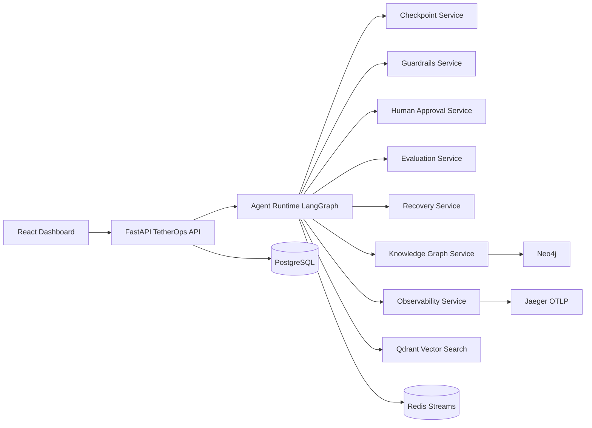
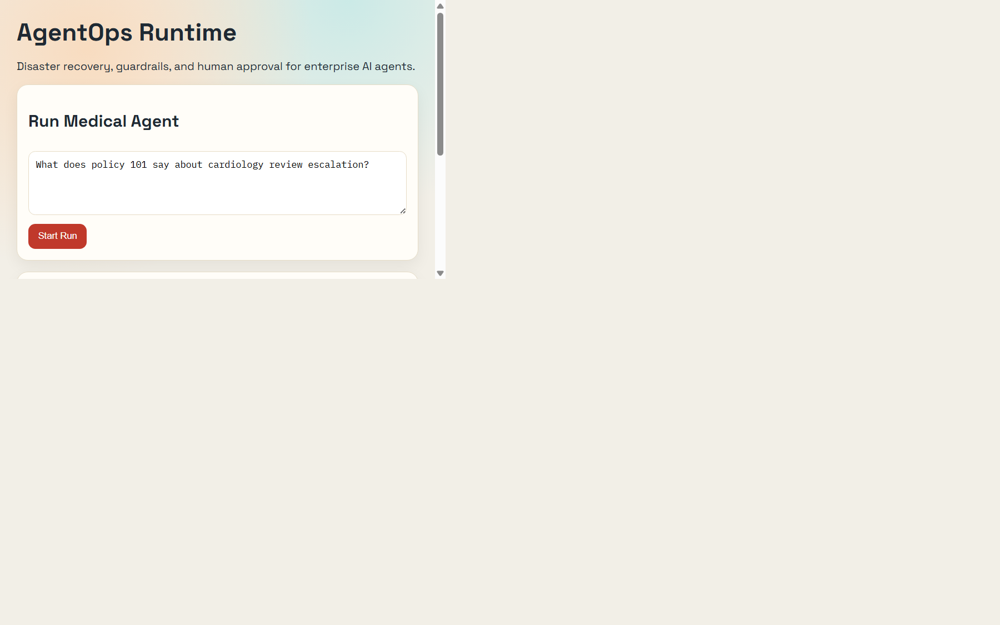

# TetherOps — Agent Reliability Platform


> **Guardrails, recovery, and observability for production AI agents.**

TetherOps is an enterprise-grade runtime that keeps your AI agents safe and reliable in production — with automatic checkpointing, disaster recovery, human-in-the-loop governance, and full OpenTelemetry traceability.

## Why TetherOps?

| Problem | TetherOps Solution |
|---------|-------------------|
| Agent crashes mid-run | Checkpoint every step; resume from last safe state |
| Bad LLM output reaches users | Policy-based guardrails block unsafe / off-domain responses |
| Regulated domain (medical, legal, finance) | Human approval gate before response is sent |
| Hard to debug agent failures | OpenTelemetry traces exported to Jaeger, full audit log |
| Context lost between runs | Hybrid memory: Qdrant (vector) + Neo4j (knowledge graph) |
| No quality signal on outputs | Evaluation service scores groundedness, relevance, precision |

## Open Source Quality

- MIT License — free to use in commercial products
- Contributing guide, Security policy, Code of conduct
- Issue and PR templates
- CI workflow: backend tests + frontend build on every push
- Dependabot for automatic dependency updates

**Core capabilities:**
- Agent disaster recovery (retry / rollback / replay)
- Step-level checkpoint persistence and resume
- Human-in-the-loop approval workflows
- AI incident root-cause analysis
- Policy-based guardrails (YAML-driven)
- OpenTelemetry-first distributed tracing
- Hybrid memory: Knowledge Graph (Neo4j) + Vector DB (Qdrant)

## Architecture



## Dashboard Preview



## Folder Structure

```text
.
├── backend/
│   ├── app/
│   │   ├── api/routes/
│   │   ├── core/
│   │   ├── db/
│   │   ├── models/
│   │   ├── schemas/
│   │   ├── services/
│   │   └── workflows/
│   ├── alembic/versions/
│   ├── tests/unit/
│   └── tests/integration/
├── frontend/
├── docs/adr/
├── k8s/
├── docker-compose.yml
└── .env.example
```

## Implemented Modules

1. agent-runtime: multi-step workflow execution and tool call lifecycle
2. checkpoint-service: step-level persistence and resume points
3. recovery-service: retry, rollback, replay metadata, root-cause summaries
4. guardrails-service: prompt injection, PII, unsafe domain checks from YAML policy
5. observability-service: OpenTelemetry spans and Jaeger export
6. evaluation-service: ragas-style groundedness/relevance/precision scoring
7. knowledge-graph-service: Neo4j context facade + vector link IDs
8. human-approval-service: pending queue + approve/reject/edit decision APIs
9. frontend-dashboard: runs, approvals, statuses, trace IDs

## API Endpoints

- `POST /api/v1/agents/run`
- `GET /api/v1/agents/runs/{run_id}`
- `POST /api/v1/agents/runs/{run_id}/resume`
- `POST /api/v1/agents/runs/{run_id}/retry`
- `POST /api/v1/agents/runs/{run_id}/rollback`
- `POST /api/v1/agents/runs/{run_id}/replay`
- `GET /api/v1/checkpoints/{run_id}`
- `POST /api/v1/checkpoints/{checkpoint_id}/resume`
- `GET /api/v1/approvals`
- `POST /api/v1/approvals/{approval_id}/approve`
- `POST /api/v1/approvals/{approval_id}/reject`
- `POST /api/v1/guardrails/check`
- `GET /api/v1/evaluations/{run_id}`
- `GET /api/v1/graph/context?query=...`
- `GET /api/v1/metrics`

## Quick Start

### Prerequisites

- [Docker Desktop](https://www.docker.com/products/docker-desktop/) installed and running
- An [OpenAI API key](https://platform.openai.com/account/api-keys) (or Azure OpenAI equivalent)

### 1 — Configure environment

```bash
cp .env.example .env
# Open .env and set LLM_API_KEY to your real OpenAI key
```

### 2 — Start the full stack

```bash
docker compose up --build
```

This launches 7 services: PostgreSQL, Redis, Qdrant, Neo4j, Jaeger, the TetherOps backend, and the React dashboard.  
A dedicated `recovery-worker` container also starts to consume Redis Stream events for retry, rollback, and replay jobs.

### 3 — Open services

| Service | URL |
|---------|-----|
| **Dashboard UI** | http://localhost:5173 |
| **API docs (Swagger)** | http://localhost:8000/docs |
| **Jaeger traces** | http://localhost:16686 |
| **Neo4j browser** | http://localhost:7474 |

## Sample Workflow: Medical Document Review Agent

This built-in workflow demonstrates TetherOps's full capability chain:

1. User submits a medical policy question via the dashboard or API
2. Runtime retrieves semantically relevant context chunks from Qdrant
3. Runtime queries related entities from Neo4j knowledge graph
4. Guardrail evaluates the query against `policy.yaml` (unsafe medical claims, PII, prompt injection)
5. High-risk outputs are routed to the **human approval queue** — pausing execution
6. Reviewer approves / rejects / edits the response via the Approvals API
7. Approved response is returned to the user with citations
8. Evaluation service scores groundedness, relevance, and precision
9. Full OpenTelemetry trace is exported to Jaeger for audit

## Sample API Requests

**Run an agent:**
```bash
curl -X POST http://localhost:8000/api/v1/agents/run \
  -H "Content-Type: application/json" \
  -d '{
    "workflow_id": "medical_document_review",
    "agent_name": "Medical Document Review Agent",
    "query": "Can you prescribe dosage for this patient?"
  }'
```

**List pending approvals:**
```bash
curl http://localhost:8000/api/v1/approvals
```

**Approve a task:**
```bash
curl -X POST http://localhost:8000/api/v1/approvals/<approval_id>/approve \
  -H "Content-Type: application/json" \
  -d '{"reviewer_notes":"Approved by medical reviewer","edited_response":"Consult licensed physician and follow policy 101."}'
```

## Test Commands

```bash
cd backend
pip install -e .[dev]
pytest -q
```

Run recovery worker locally:
```bash
cd backend
python worker.py
```

## Database Schema

Tables:
- agent_runs
- agent_steps
- checkpoints
- tool_calls
- guardrail_events
- approval_tasks
- evaluation_results
- trace_events
- recovery_actions

## Future Roadmap

1. Native Azure OpenAI and OpenAI tool-call adapters with token accounting
2. Real Qdrant retrieval and Neo4j graph write-back for agent decisions
3. Redis consumer workers for async replay/recovery execution
4. Multi-tenant RBAC, SSO, and audit-grade immutable event logs
5. Incident timeline UI and run-diff replay visualizations
6. Policy DSL with versioned rollout and canary guardrails
7. Kubernetes Helm chart with HPA, PDB, and secrets integration

See the full roadmap in [docs/ROADMAP.md](docs/ROADMAP.md).

---

## Contributing

We welcome contributions! Please read [CONTRIBUTING.md](CONTRIBUTING.md) and follow the [Code of Conduct](CODE_OF_CONDUCT.md).

## Security

Please report vulnerabilities via [SECURITY.md](SECURITY.md). Do not open public issues for security bugs.

## License

[MIT](LICENSE) © TetherOps Contributors
